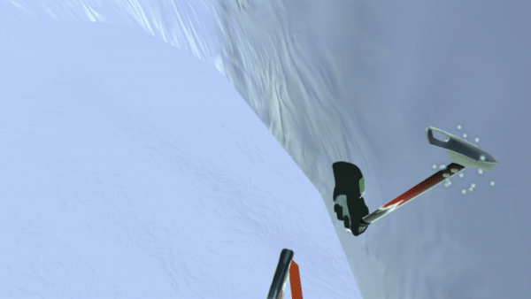
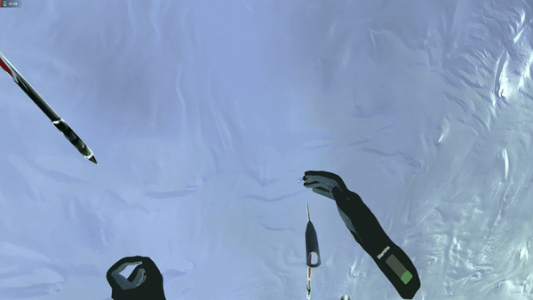
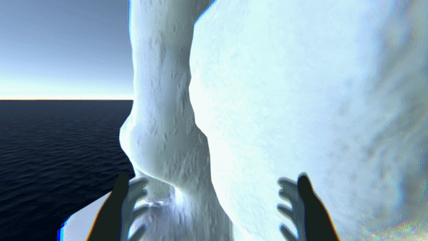

# IcyClimb

IcyClimb is my first mini-project with Unity. Ascend an icy wall using your trusty ice picks and lead climbing.

[Short demo video (no sound effects)](https://www.youtube.com/watch?v=9Nr1YvCzW9E)

## Attributions

This project exclusively uses free assets, either from the Unity store or through other channels.

The following content is used in this project:

* 'Permafrost' by Scott Buckley - released under CC-BY 4.0. [www.scottbuckley.com.au](www.scottbuckley.com.au)
* Wind loop and water Loop from: Nature Sound FX by Lumino [Asset Store](https://assetstore.unity.com/packages/audio/sound-fx/nature-sound-fx-180413) | [Publisher Website](https://luminoassets.com/)
* Snow footsteps sound effects from: Footstep(Snow and Grass) by MGWSoundDesign [Asset Store](https://assetstore.unity.com/packages/audio/sound-fx/footstep-snow-and-grass-90678) | [Publisher Website](https://soundcloud.com/valery-oleynikov)
* Slipping sound effect from: Footsteps Gravel by Sound Works 12 [Asset Store](https://assetstore.unity.com/packages/audio/sound-fx/foley/footsteps-gravel-175348) | [Publisher Website](https://soundcloud.com/udk62msvdvkx)
* IceAxe by RRFreelance: [Asset Store](https://assetstore.unity.com/packages/3d/props/tools/ice-axe-20492#reviews) | [Publisher Website](https://www.robertramsay.co.uk/)
* Simple Water Shader URP by IgniteCoders: [Asset Store](https://assetstore.unity.com/packages/2d/textures-materials/water/simple-water-shader-urp-191449) | [Publisher Website](https://github.com/IgniteCoders)
* Yughues Free Sand Materials by Nobiax / Yughues: [Asset Store](https://assetstore.unity.com/packages/2d/textures-materials/floors/yughues-free-sand-materials-12964) | [Publisher Website](https://www.artstation.com/yughues)

## Development log

Below find some select highlights of elements that went into the development of IcyClimb.

### 3D Modeling

The cliff was modeled in Blender. It was first prototyped using metaballs, then converted to a mesh and details added using sculpting tools. 
A texture was generated procedurally using a shader consisting of about 40 nodes and then baked into a 12,288x12,888 texture and normals, as well as a 8192x8192 metallic map (baked from glossy).
The procedural shader was heavily inspired by [this Blender tutorial by YouTuber polygonartist.](https://www.youtube.com/watch?v=0Eg0uZDEktk).

In Unity, the texture is further complemented with a detail Texure from Yughues Free Sand Materials Asset pack.

Other objects I modeled in Blender were the wall anchors, the belay device, and the hands.
The hands were painted with two different materials, one using a procedural shader to create the knobbed texture of the palm grips, and the black texture mostly painted manually. 

### Animation

The only animation I created for IcyClimb is that of closing your hand to grip something. 
Since I had never done this before, I learned from [CGDive's Blender tutorials on YouTube](https://www.youtube.com/watch?v=hdGkKbtQxE0).

I rigged the hand with a game rig and a control rig, and created two poses: 1) natural and 2) grabbing. 
The animation controller was kept simple.
A single bool parameter `b_grab` controls transitions. 
It can transition to the Grab state from any state except itself (that is, from Idle or Ungrab if `b_grab` is true. 
Only if `b_grab` is false, can it transition from Grab to Ungrab, which plays the grab animation in reverse.
From any state except the grab state (disallow self transition) to transition back to the grab state. This avoids a looping grab animation.

### Sound design

Two ambient sound loops are used from the Nature Sound FX by Lumino from the Unity Asset store:
At the bottom of the cliff a spatial audio source plays the Water sound effect representing the sea, while at the top another spatial audio source plays the Wind loop. 
This way, as you ascend the cliff, the water becomes quieter and the wind becomes stronger.

As the player approaches about 80\% of the cliff's height. Permafrost by Scott Buckley is played and the credits appear over the horizon. You can probably guess that this was inspired by Kojima Productions' Death Stranding. 

A number of sound effects were taken from free Unity Assets from the Asset Store (see the Attributions section at the top of this page). 
These include:
* A random snow footstep sound whenever the player moves 0.75m
* A gravel footstep sound whenever the player loses solid ground (slips off a slope)

A few sound effects in the game are **home-made**, recorded with my regular Antlion ModMic (no professional audio equipment) and edited in Audacity:
* 6 different ice sound effects for when the ice pick or wall anchor lodged into ice: [1](Assets/Audio/SFX/ice1.wav)  [2](Assets/Audio/SFX/ice2.wav) [3](Assets/Audio/SFX/ice3.wav) [4](Assets/Audio/SFX/ice4.wav) [5](Assets/Audio/SFX/ice5.wav) [6](Assets/Audio/SFX/ice6.wav)     
What it is: Me smashing ice cubes with a stone mortar and pestle.
* 1 hand slipping sound played when you run out of stamina and thus lose your grip: [1](Assets/Audio/SFX/handslip1.wav)     
What it is: Me grabbing my Shinai and pulling on the Tsukagawa until I lose my grip and it slips out of my hand.
* 1 dislodge sound played when you dislodge the ice pick or the wall anchor from the ice: [1](Assets/Audio/SFX/dislodge1.wav)    
What it is: Me pulling a kitchen knife out of some ice cubes
* 1 wind-in-ear sound which is played when you fall very fast: [1](Assets/Audio/SFX/WindInEarLoop.wav)     
What it is: This is just be blowing into the microphone. Aside from general pitch/speed adjustments, I also looped it by copying the sound and reversing the copy, thus creating a smooth loop.

### Locomotion

There are three ways in which the player can move:
* Controller input: continuous movement and turning
* Pulling: The player can use the ice picks, lodge them in the wall, and then pull (or push) themselves to (from) the picks. 
The same principle of movement can also be used with rope. A player can grab the rope and pull themselves towards where they grabbed the rope. 
This can be done with both hands - also simultaneously.
* Falling: If the player stands on a slope, the player will slide down the slope. 
If the player does not have solid ground beneath their feet, they will also fall. 
However, the rope secures the player, so the player must fall as one would expect when secured with a rope.
That is to say, the player cannot overstretch the rope when falling and must "pendulum" towards the point where the rope would rest.

Since these three forms of movement are also highly connected, I implemented a single dedicated `PlayerLocomotion` class which implements a `LocomotionProvider` with all these features. 

At the basis for pulling movement is the `IPullProvider` interface, which provides the direction and strenght of pull, as well as whether this pull provider is strong enough to ignore gravity.
For example, lodging an ice pick into ice and pulling yourself towards it, does not initiate a fal, while grabbing the rope while climbing lead should still initiate a fall.

Whether or not a player falls is determined through a combination of the `CharacterController.IsGrounded`, as well as an custom `SlopeScanner` I implemented to determine how even the ground is.

The `SlopeScanner` emits a number of Rays diagonally in a circle around the player's feet. 
For each ray, the normal of the terrain is evaluated and an average normal is computed. 
The angle between the UP vector and the average normal is then used to determine whether the player can continue to move or will fall.
Furthermore, the average normal will be used to determine fall direction, such that players will fall away from the wall (in addition to gravity pulling them down), thus causing the player to slide.

A player can also lodge a wall anchor in the wall and secure the rope in it. 
When a player falls or is about to fall, the game computes the distance between the player and the wall anchor in order determine how much slack the player has. 
Like with a real belay device, the belay device at top of the belt "locks" the rope lenght when the player falls (when the rope comes out the top of the belay device).

Using controlled falling with a rope secured overhead, while using the belay device to give yourself more rope, can also be used to rapell down.

### Blindfold shader

Since the player spends a lot of time close to the wall, it was important to me to prevent players from peeking inside the wall, as it may be strongly immersion breaking.
I do not like the idea of pushing players away from the wall if their head comes close to it, as this can cause motion sickness. 
Instead, I decided to blindfold players when their heads are inside the wall. 
However, this blindfold should be gradual and correspond to the direction of the collision. 
For example: if a player leans to the left into a wall, their vision should be partially blacked out on the left while still being able to see freely on the right.

To do so, I implemented a shader graph which i call the blindfold shader.

The blindfold shader takes the direction and magnitude of the camera's wall penetration as an input, then computes a radial gradient and moves it based on the direction.
This shader is then used to render an image on a canvas right in front of the main camera's near clipping plane. 
I would have liked to render it as a screen overlay instead, but that doesn't appear to work if the image has an alpha channel.
I then use a box collider around the camera's near clipping plane, which triggers the `NoWallhack` script.
In this script, I evaluate all colliders (on the "Wall" layer) that are currently colliding with this box collider, and determine how deep the camera is inside the wall collider, in order to pass on the parameters to the shader.

Since mesh colliders, like our ice wall, are not necessarily convex, another challenge was to determine whether the player had exited the wall or fully penetrated it.
When a player would fully dive into a wall, Unity would fire `OnCollisionExit` as soon as the wall's mesh no longer intersected with the box collider.
To handle this, I use raycasting to determine whether the the player's body can be seen from the main camera. 
If it isn't, we consider the player has still not exited the wall and vision should remain obscured.

### Rope physics

The rope is simulated as a kind of bead-chain, and then rendered using a `TrailRenderer` which draws a trail from the start of the rope, following each chain link, until the end. 
Initially I attempted to use existing unity `ConfigurableJoint` components.
However, I found them insufficient for my purpose (or simply could not figure out how to use them to do what I wanted them to do).

I therefore implemented the `ChainLink` class, which represents an item in a doubly linked list, with pointers to the next and previous `ChainLink`. 
These `ChainLink` contain rigidbodys and sphere colliders with a physics material, such that they can be affected by gravity, drag, and friction.
In addition, each `ChainLink` applies force to its neighboring `ChainLink` based on their relative position.
In other words, each `ChainLink` pulls its neighbors towards itself.

The end-links which represent the start and end of the chain, can have their rigidbodys set to kinematic and therefore act as fixed anchors that cannot be moved. 
As a result, the remaining links will distribute themselves between the kinematic nodes, while still being affected by gravity, drag, and friction.
This means that the rope can be extended to infinite length, simulating in this case that there is an infinite amount of rope on the spool at the ground.
However, that also means that the resolution of the rope (the inverse of the distance between links) decreases as the rope is extended.

To adjust the resolution of the rope, each `ChainLink` can also be configured as a spawner, that will spawn more rope as the links are extened to a certain length, simulating the spool which gives more rope when sufficiently pulled.

The texture used for the `TrailRenderer` drawing the rope was drawn as a vector graphic in Inkscape and should represent the threads in a real climbing rope.

In order to facilitate pulling locomotion along the rope, a `RopeManipulator` grabbable object with a kinematic `ChainLink` will follow hand movement (one for each ahnd) along the rope - always staying on the rope, but as close to the hand as possible.
Players can grab this `RopeManipulator`, in which case the `ChainLink` will insert itself in the rope, such that the rope will then follow the hand movement. 
The player can then both move the rope (e.g. in order to attach the rope to a wall anchor) as well as move themselves along the rope (e.g. pulling yourself up).

### Photo triggers

As a little easter-egg or reward for finishing the game, I set up multiple photo triggers along the course. 
These consist of large sphere colliders which are triggered by the player, and a camera set up to point at the sphere.
Each of the 6 photo trigger cameras is set to output its result to a render texture.
The cameras are disabled by default as to not cause overhead.
Only when they are triggered, will they be enabled for a single frame before being permanently disabled.
This essentially captures a snapshot of the player as they reach certain locations on the course.

These snapshots are then presented to the player when they reach the goal.

### Visual effects

The first visual effect I implemented was a simple particle effect when the ice pick hits the ice and gets lodged.

Another particle effect I implemented is a the effect played on your hand when you get a stamina boost.
Simulating how a person with a tired hand might shake out their hand to recover, I implemented a method for detection of shaking movement.
When a player shakes their hand, they get a small stamina boost and a little green plus appears over their hand.

Finally, I implemented a screen distortion effect through a combination of post-processing effects, played when the player falls at a great speed.
To do so, I implemented a behavior which records the player's speed (smoothed over multiple frames).
Once a certain threshold speed is reached, the intensity of screen distortion is then calculated as a linear interpolation between minimum speed and maximum speed.

The following combination of post-processing effects is then applied:
* Chromatic abberation: meant to simulate the feeling of adrenaline when falling
* Motion blur: self explanatory
* Lens distortion: In order to simulate the wind hitting the player's face, I ocilate lens distortion between a positive and negative value with the magnitude of the screen distortion intensity calculated above

### Coding conventions

Coding conventions with regards to variable naming and class organization follow the propositions published by https://github.com/justinwasilenko/Unity-Style-Guide
